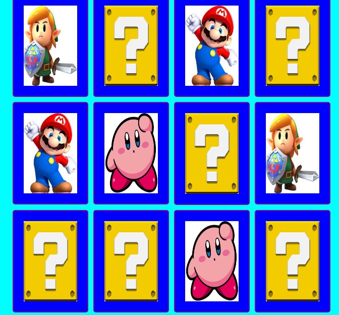
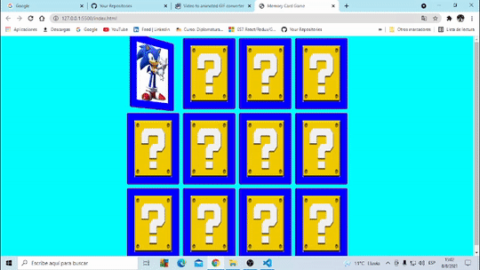

# Juego-de-Memoria
Hecho con Javascript , Html y Css

El juego consta de un tablero y cartas,se termina cuando se encuentran todos los pares iguales.Cada carta tiene dos caras, una igual para todas(backface)y una singular(frontface).

Para girar las cartas,primero tome la clase de todas las cartas a  travez de QuerySelectorAll, luego con el metodo forEach recorre el arreglo de cartas y adjunta un  addEventListener con un evento click ,para que al clickeraese la carta ,se ejecute la funcion de girar.Para que gire  le puse  una clase de css a las cartas,que roten 180°.

Para que el emparejamiento de cartas use un operador ternario en donde ,si la primera carta coincide con la segunda,es un emparejamiento,y se deshabilitan esas cartas.

